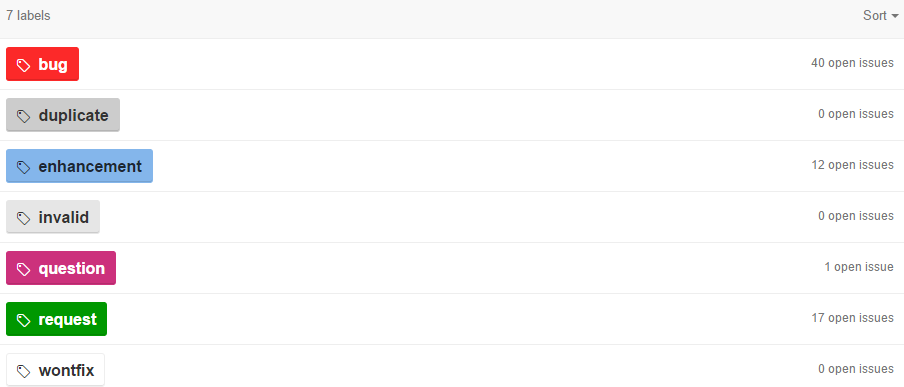

# Software Processes in Pencil2D

## Introduction

### Software Processes

### About Pencil2D

## Software Process Roles

In any software development process there are different roles performed by the people involved. If the team is not very strictly organized, these roles may be somewhat merged and performed by a same person. This seems to be the case with Pencil2D, as we discuss below, where we present the main roles that can be found in the project.

### Client

In general, the role of the client is performed by a representative of the organization that requested the software. Sometimes, the person performing this role is not from the client company, but from the development company. In any case, its the job of this person to guarantee that the software requirements are met, as well as generally speak for the client company.

Pencil2D does not have a client company. Not in the strict sense at least. The software is simply being developed for anyone who might have an interest in its features. Although "random" people on the internet do make feature requests, these people do not have a representative that coordinates their efforts. Also, since they are not paying for anything, there is a clear limit to how much pressure they can place on the development team. Thus, the role of the client is somewhat performed by whomever decides to use the application and comment on it, but with many restrictions in their power to really influence the development process.

### Project Manager

The project manager is, in a sense, the leader of the development team. It is their responsibility to supervise the planning, execution and, eventually, conclusion of the project. Also, most of the decisions may fall on the project manager.

Currently, the project manager of Pencil2D seems to be the main developer: [Matt Chang](https://github.com/chchwy). This is the person in charge of driving the project forward, either by personally contributing with increments, or by coordinating the efforts of others and ensuring that their contributions are successfully merged. Matt is also the person that started Pencil2D, by forking it from the "dead" project Pencil.

### Developer

The developer(s) of a software project are responsible for both the design and the programming. In ancient software development methods, these roles where performed by different people. While some would theoretically conceive the whole application, like the architects who create the plans for a building; others would actually code these ideas, thus being the constructors of the building. This is not the case anymore, not in any current software development process. The main reason for this being the fact that, these days, software is so complex and has so many lines of code, it would be virtually impossible for any person to simply conceive the whole design, while not getting involved in the actual programming.

As stated above, Pencil2D has a main developer, who contributes most of the design and code. The other developers, making a current total of 14, vary a lot productivity. Some have only made on or two short commits, while others have contributed some thousand lines of code. In any case, they all seem to be free agents, instead of belonging to a cohesive team. 

The following image illustrates the contribution of some of the project members.

## Software Process Activities

All software processes are characterized by similar activities, although the way they are organized depends on each specific process. In this section we describe the four main activities and the way they are addressed in Pencil2D. 

### Specification

The objective of software specification is to determine the requirements of the software. The client should let the development team know how the software will be used, by whom, to which effect and under what circumstances. It is very important to decide what the software is supposed to do with precision, because everything else will follow from this stage. 

A part from the user requirements, system requirements, which are more detailed and oriented for the software developers, also should be determined in the phase. This whole part of the process can be split in four activities:

1. Feasibility Study - A quick analysis to decide whether the project is possible and cost-effective, whose result should inform if further analysis should be mande;  
2. Requirement Elicitation - The system requirements are obtained from the discussion with potential users and the observation of other systems;
3. Requirements Specification - The information from the previous stage is written in a document;
4. Requirements Validation - The requirements are checked for consistency, realism and completeness.

These activities may not be performed strictly in this order. Also, the software requirements may be updated throughout the development, depending on the software process used.

It is not completely clear how the software specification was initially performed in Pencil2D. The idea was to develop "a tool for creating traditional animation, using both bitmap and vector graphics; which was intuitive, cool, light, open source, cross-platform...". However, we could not find a detailed list of early system requirements, from the time of Pencil. 

In any case, there is a task list, dating from the time when Pencil was forked into Pencil2D, whose contents are features to be added to the software. Since there is no proper client for the application, that part of their role was performed by the Project Manager.

### Design and Implementation

This is the stage where the software is actually built in order to match the system requirements. In order to accomplish that, there are processes of design and programming.

The design is a description of the structure of the software, its interfaces and sometimes the algorithms that will be used. The different components of the software should be identified and described, as well as their organization as a whole. The interfaces between different components and between the software and the user also need to be detailed.

The image bellow contains a diagram for the implementation of Pencil2D gives some indication of its design process. Accompanying it there is a description of the ideas the main developer has regarding the organization and the role of the several components of the software as he wishes them to be. Although these designes could be better organize, they do show some concern with this stage of the development process.

From the software design, the implementation should come naturally. Along with programming the software, some programmers also perform some tests on it, in order to check that their code is doing what is intended. Has in a previous chapter, in Pencil2D the development is mainly done by a single person. But there are other programmers who occasionally contribute, some more than others.

As evidenced by the image bellow, whether the coding is done by the main developer or by someone else, there seems to be a concern to isolate each small increment in its own development fork. This shows a well organized programming process, that is specially helpful if several people are working together or if a single developer wants to dedicate himself to different parts of the software simultaneously.

The implementation that is being done in Pencil2D is one of the main evidences to the use of a sort of incremental delivery software process. There are nightly builds and beta releases and the software requirements are updated throughout the development. There is also some mild evidence of agile methods, with some circular software processes. However, this is not very well accomplished, because there are hardly any established timeframes. For example, currently there are two open and no closed milestones. But the open milestones have no due date. We will discuss this in further detail in a following chapter.

### Validation

This is the part of the process where the software is tested, in order to ensure that it conformes with the specification. In medium or large programs, this verification should be modular, in the sense that each component of the software should be tested individually, instead of only testing the full finished application. This modular approach reduces the time needed for validation and makes error correction easier and faster.

Software testing can be done in three main stages:

1. Development testing - the developers debug the code as they write it, as mentioned in the previous section;
2. System testing - the different components of the software are integrated and the result is tested, finding errors that where not visible in any single module;
3. Acceptance testing - the system is tested with real data, instead of simulated test data.

Pencil2D has at least two distinct evidences of software testing. The first is a set of tests in the Qt framework. Up to this point, we could not determine weather these tests were developed before or after the code that they aim to test. Therefore, we can not confirm if some part of the development process was test-driven. In any case, it seems to concern the application as a whole.

Another set of tests are being performed by the end users. These tests are clearly using real data and therefore are a part of acceptance testing. They also provide evidence to a circular process: requirements, development, testing, more requirements, more developing, etc.

Of course there must also be some development testing, otherwise the application would not even compile and run, with all the bugs that would certainly plague it.

### Evolution

This stage of the software process aims to better deal with the fact that these days, most software is a kind of living organism. One no longer develops an application and considers it finished. With the use, new features will be requested, new bugs will be discovered and all this will lead to further development. 

In a way, it was a kind of software evolution that led to Pencil2D. Since the creators of Pencil where no longer able to continue developing it and there was a feeling that some important features where still missing, Matt Chang felt that he should provide the necessary continuity. 

There is also some clear evolutionary contribution made by the end users. In addition to reporting bugs, they also request new features, some of which may be considered for future developments. All of this is quite clear in the list of issues maintained in the project's repository. While most of these issues are bugs, some are suggestions of application enhancements and others are requests, as the following image shows.

## Factors

## Incremental Delivery

## Conclusion

